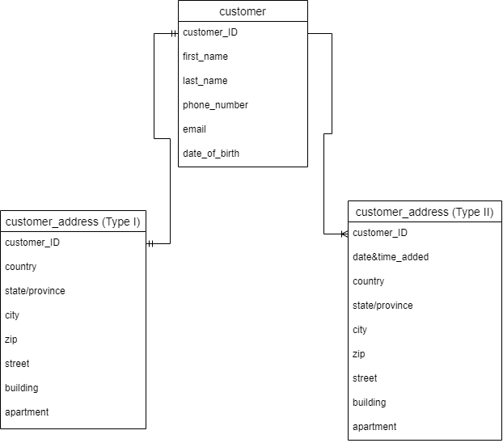

# Assignment 1: Design a Logical Model

## Question 1
Create a logical model for a small bookstore. 📚

At the minimum it should have employee, order, sales, customer, and book entities (tables). Determine sensible column and table design based on what you know about these concepts. Keep it simple, but work out sensible relationships to keep tables reasonably sized. Include a date table. There are several tools online you can use, I'd recommend [_Draw.io_](https://www.drawio.com/) or [_LucidChart_](https://www.lucidchart.com/pages/).

My logical model for questions 1-2 is as follows:


## Question 2
We want to create employee shifts, splitting up the day into morning and evening. Add this to the ERD.

## Question 3
The store wants to keep customer addresses. Propose two architectures for the CUSTOMER_ADDRESS table, one that will retain changes, and another that will overwrite. Which is type 1, which is type 2?

_Hint, search type 1 vs type 2 slowly changing dimensions._

Bonus: Are there privacy implications to this, why or why not?


```
The architectures are described in the image. The table on the left (which I called type I, sorry if this does not coincide with your labels!) will overwrite changes. It has customer_ID as a primary column and that is why the relationship with the customer table is 1-1. If you want to change the address your only way is to update the existing record. The table on the right (I called it type II) will retain changes. It does not have primary key, so you can add as many addresses to one customer as you wish, but this table has date&time_added column which will show when does the address was added. If you want to find the last one you should sort this table by this time column and that is how you can retain changes.

Since the address is private information there can be privacy implications. The database should be accessed only by specified employees, to ensure that there will not be any data leakages. 
```

## Question 4
Review the AdventureWorks Schema [here](https://i.stack.imgur.com/LMu4W.gif)

Highlight at least two differences between it and your ERD. Would you change anything in yours?
```
First of all, the AdventureWorks Schema is huge in comparison with my own schema and much more complete. There is a sophisticated system for sales section, which includes the possibility of having several stores. Also, the information stored about a product is really deep (there is product cost history, for example). I also like the idea of product subcategory. In my case, this could be the information about the publisher. And subcategory could be used as a way to store information about book series. Additionally, I like the idea of shopping carts, because this is a clever way to store information about orders with more than one book. 
```

# Criteria

[Assignment Rubric](./assignment_rubric.md)

# Submission Information

🚨 **Please review our [Assignment Submission Guide](https://github.com/UofT-DSI/onboarding/blob/main/onboarding_documents/submissions.md)** 🚨 for detailed instructions on how to format, branch, and submit your work. Following these guidelines is crucial for your submissions to be evaluated correctly.

### Submission Parameters:
* Submission Due Date: `June 1, 2024`
* The branch name for your repo should be: `model-design`
* What to submit for this assignment:
    * This markdown (design_a_logical_model.md) should be populated.
    * Two Entity-Relationship Diagrams (preferably in a pdf, jpeg, png format).
* What the pull request link should look like for this assignment: `https://github.com/<your_github_username>/sql/pull/<pr_id>`
    * Open a private window in your browser. Copy and paste the link to your pull request into the address bar. Make sure you can see your pull request properly. This helps the technical facilitator and learning support staff review your submission easily.

Checklist:
- [x] Create a branch called `model-design`.
- [x] Ensure that the repository is public.
- [x] Review [the PR description guidelines](https://github.com/UofT-DSI/onboarding/blob/main/onboarding_documents/submissions.md#guidelines-for-pull-request-descriptions) and adhere to them.
- [x] Verify that the link is accessible in a private browser window.

If you encounter any difficulties or have questions, please don't hesitate to reach out to our team via our Slack at `#cohort-3-help`. Our Technical Facilitators and Learning Support staff are here to help you navigate any challenges.
